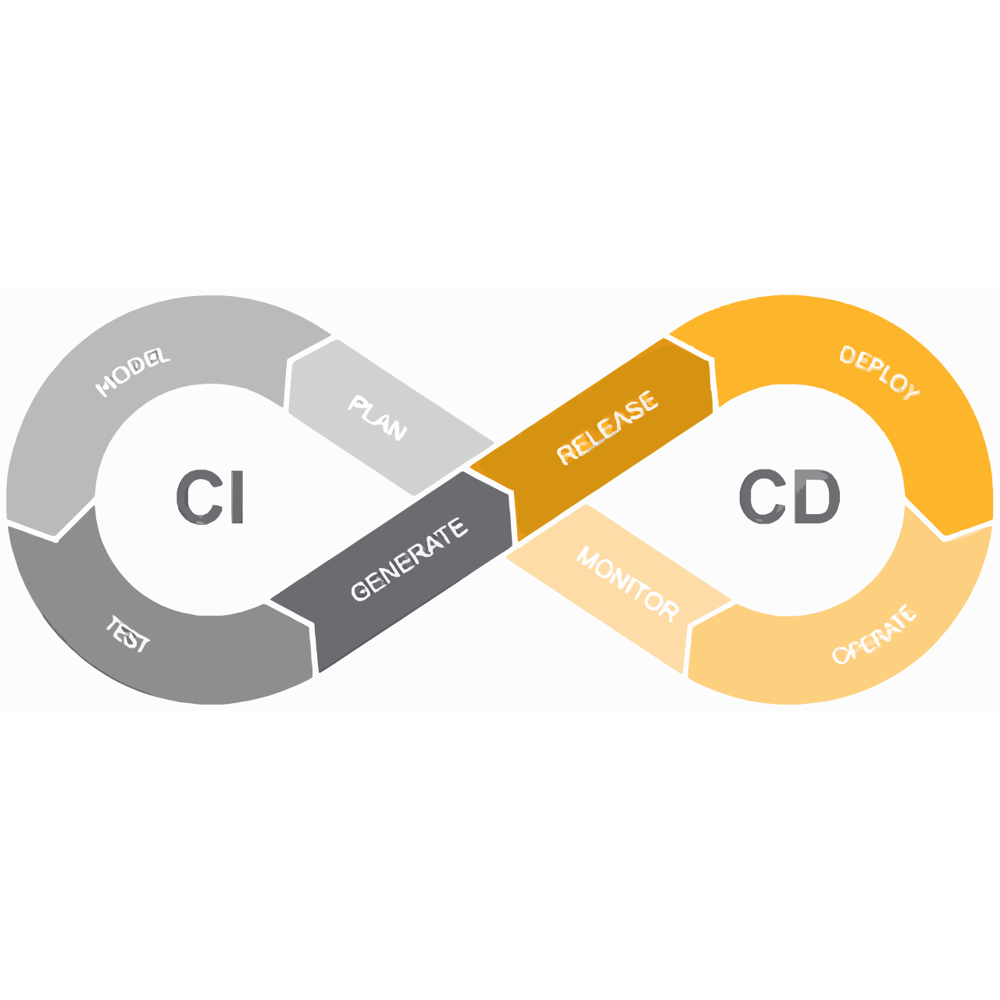

<h1> 👋 Hello, I'm Abdul Barik </h1>
<b><h2>Full Stack Developer</h2></b>

 

  
  
  
   
   

 

👨‍🏫 &nbsp; About Me

I’m Abdul Barik, a passionate Full Stack Web Application Developer with a knack for transforming ideas into dynamic, user-friendly web solutions. I specialize in both front-end and back-end development, ensuring seamless integration and exceptional performance across the entire stack.

 
👨🏽‍💻 &nbsp; Technical Expertise:

   
   
   
   
   
   
   
   
   
   
   
   
   
   
   
   

