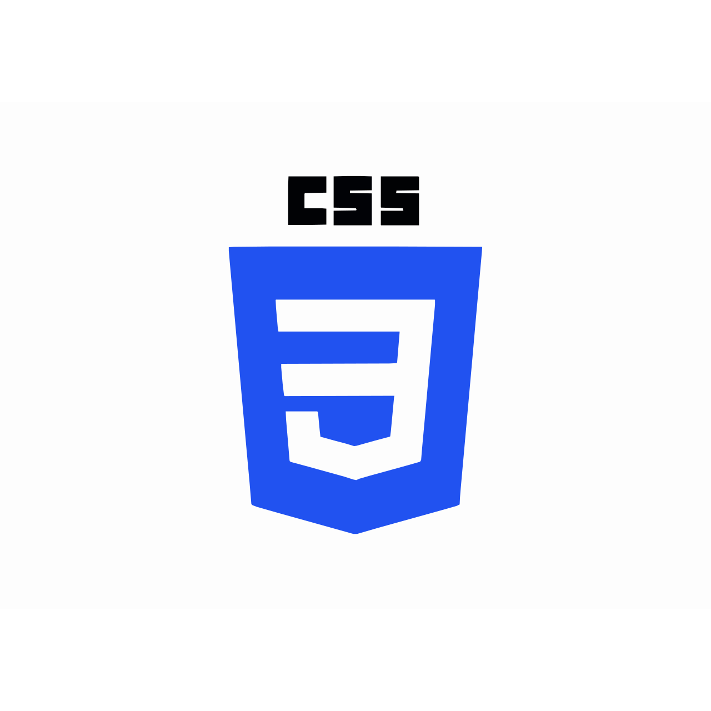
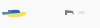
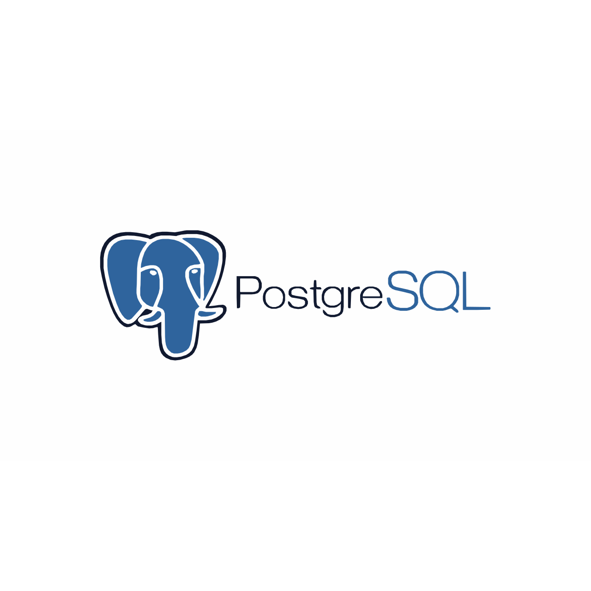

<!-- <h1> 👋 Hello, I'm Abdul Barik </h1>
<b><h2>Full Stack Developer</h2></b>

 

  
  
  
   
   

 

👨‍🏫 &nbsp; About Me

I’m Abdul Barik, a passionate Full Stack Web Application Developer with a knack for transforming ideas into dynamic, user-friendly web solutions. I specialize in both front-end and back-end development, ensuring seamless integration and exceptional performance across the entire stack.

 
👨🏽‍💻 &nbsp; Technical Expertise:

   
   
   
   
   
   
   
   
   
   
   
   
   
   
   
   

 -->

<!-- Banner -->

<h1 align="center">Hi there, I'm Abdul Barik 👋</h1>
<h3 align="center">Full Stack Web Developer | MERN Stack | Open Source Enthusiast</h3>

---

## 🧑‍💼 About Me

Passionate Full Stack Developer from Bangladesh 🇧🇩 with a strong interest in crafting clean and scalable web applications. I enjoy solving real-world problems through code and continuously learning new technologies.

---

## 🚀 Currently Exploring / Working On

- 🌐 Building a **tourism website** using the MERN Stack.
- 🧪 Exploring **Next.js** and **server-side rendering** techniques.
- 🔐 Improving **security** in user authentication flows.
- 🎯 Working on my personal **task manager app** for better productivity.

---

## 🛠️ Skills

  
  
  
  
  
  
  
  
  
  
  

---

## 🌐 Connect with Me

  
  
  
  
  
  
  

---

## 📈 GitHub Stats

  
  

  

