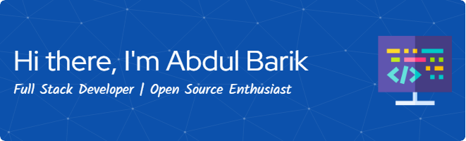

<!-- Banner -->

---

  
  
  
  
  

---

## 🧑‍💼 About Me

Passionate Full Stack Developer from Bangladesh 🇧🇩 with a strong interest in crafting clean and scalable web applications. I enjoy solving real-world problems through code and continuously learning new technologies.

---

## 🚀 Currently Exploring / Working On

- 🌐 Building a **tourism website** using the MERN Stack.
- 🧪 Exploring **Next.js** and **server-side rendering** techniques.
- 🔐 Improving **security** in user authentication flows.
- 🎯 Working on my personal **task manager app** for better productivity.

---

## 🛠️ Skills

  
  
  
  
  
  
  
  
  
  
  

---

## 📈 GitHub Stats

  
  

  

